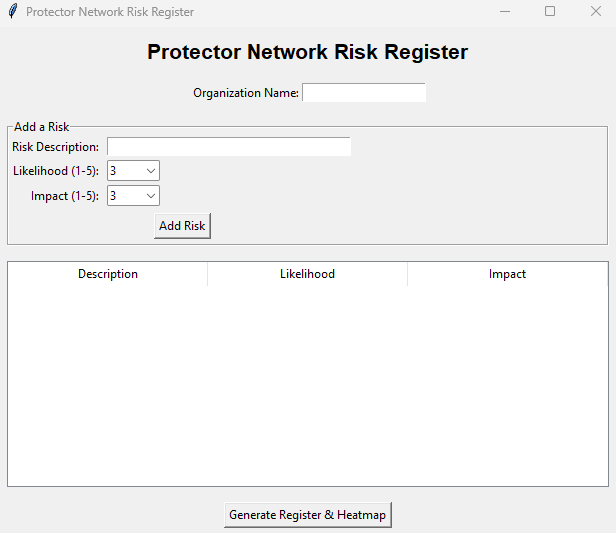

# Risk Register
A simple program that allows a mission organization to input risk variables, the likelihood of those risk, and the impact that they would have. It then creates a risk register and associated heat map in .csv format for download.

